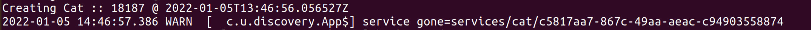

# Ubirch Zookeeper Service Discovery

This repository is a proof of concept of using Zookeeper as a service discovery mechanism for microservices. Zookeeper is a highly reliable distributed service that enables microservices to control configurations, naming, and coordination of processes. You can learn more about it here:  https://zookeeper.apache.org/ and if you have some time for a video, here: https://youtu.be/Vv4HpLfqAz4.

Service discovery is a required characteristic in distributed systems. Microservices need to learn how to observer with which systems they can talk based on their needs, or availability. Service discovery is the process that is used for services to register their presence, and available controls; and for services to use registered services. 

## Flow of information

The following image represents a configuration sequence for a service provider and a service consumer by means of using Zookeeper.


## Project structure

The project is organized into three modules:

* `common`: it represents a collection of common tools. In particular, it provides, an abstraction on how to get started via [Apache Curator](https://curator.apache.org/).
* `service`: it represents the service provider that offers an endpoint to create "cats". "Cats" created here are not fancy or anything. 
* `discovery`: it represents the service consumer that calls on the service provider's endpoint to create cats.

## How to run

Download Zookeeper from https://zookeeper.apache.org/. At the time of writing this document, the version used was: 3.7.0. Follow the instructions here to get started with Zookeeper. https://zookeeper.apache.org/doc/current/zookeeperStarted.html.

Have Zookeeper running.

Compile the demo
```bash
mvn clean package
```

Run the service provider
```bash
java -cp service/target/service-0.0.1.jar com.ubirch.service.App
```

Run the service consumer
```bash
java -cp discovery/target/discovery-0.0.1.jar com.ubirch.discovery.App
```

## How to see it in action

If you have all running in the sequence presented above, you will see that the service consumer will start outputing "cats".


However, if you stop the service provider, you shall see that the discovery service detects these changes.

