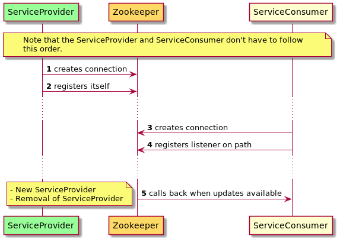
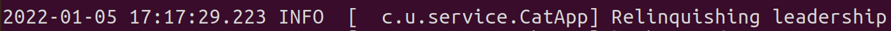

# Ubirch Zookeeper Service Discovery

This repository is a proof of concept of using Zookeeper as a service discovery mechanism for microservices. Zookeeper is a highly reliable distributed service that enables microservices to control configurations, naming, and coordination of processes. You can learn more about it here:  https://zookeeper.apache.org/ and if you have some time for a video, here: https://youtu.be/Vv4HpLfqAz4.

Service discovery is a required characteristic in distributed systems. Microservices need to learn how to observer with which systems they can talk based on their needs, or availability. Service discovery is the process that is used for services to register their presence, and available controls; and for services to use registered services. 

Another very equally important concept in distributed services is leadership among microservices. That's to say that among the instances of one particular microservice, there is a leader instances, which is in charge of executing a particular task, which is only meant for everybody to execute.

## Project structure

The project is organized into three modules:

* `common`: it represents a collection of common tools. In particular, it provides, an abstraction on how to get started via [Apache Curator](https://curator.apache.org/).
* `service`: it represents the service provider that offers an endpoint "create" to create "cats". "Cats" created here are not fancy or anything. This service has a special function that will be only activated when the corresponding instance is has gained leadership over its kinds. This special function is the creation of yellow cats, otherwise, red cats are created.
* `discovery`: it represents the service consumer that calls on the service provider's endpoint to create cats.

## Flow of information for a service discovery

The following image represents a configuration sequence for a service provider and a service consumer by means of using Zookeeper.



## Flow of information for leadership


## How to run

Download Zookeeper from https://zookeeper.apache.org/. At the time of writing this document, the version used was: 3.7.0. Follow the instructions here to get started with Zookeeper. https://zookeeper.apache.org/doc/current/zookeeperStarted.html.

Have Zookeeper running.

Compile the demo
```bash
mvn clean package
```

Run as many service providers. Two or three are nice to see what happens. Increase the port.
```bash
java -cp service/target/service-0.0.1.jar com.ubirch.service.App 8081
```

Run the service consumer
```bash
java -cp discovery/target/discovery-0.0.1.jar com.ubirch.discovery.App
```

## How to see it in action

### Service Discovery

If you have all running in the sequence presented above, you will see that the service consumer will start outputing "cats".


However, if you stop the service provider, you shall see that the discovery service detects these changes.


### Leadership selection

By default, the first application that gets registered on Zookeeper will be the leader of the pack. By running two instances of the cats creator, you will see how it is possible for the apps to take leadership, and relinquish when exiting the pack. 

Taking leadership


Relinquishing leadership



Creating Yellow Cats changes instance as the leadership changes


