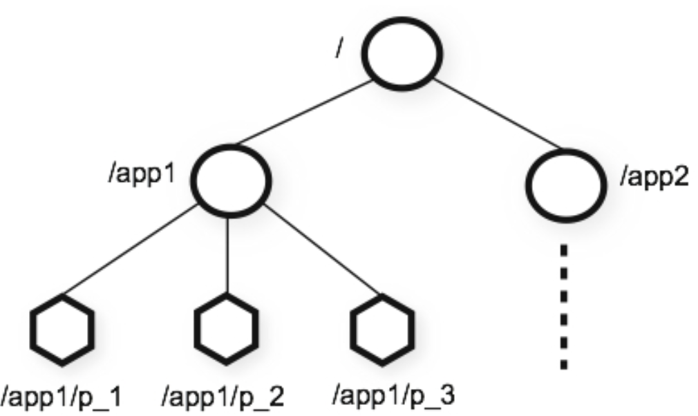
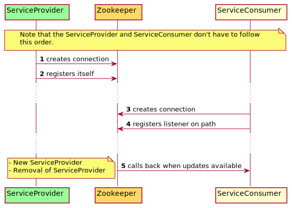
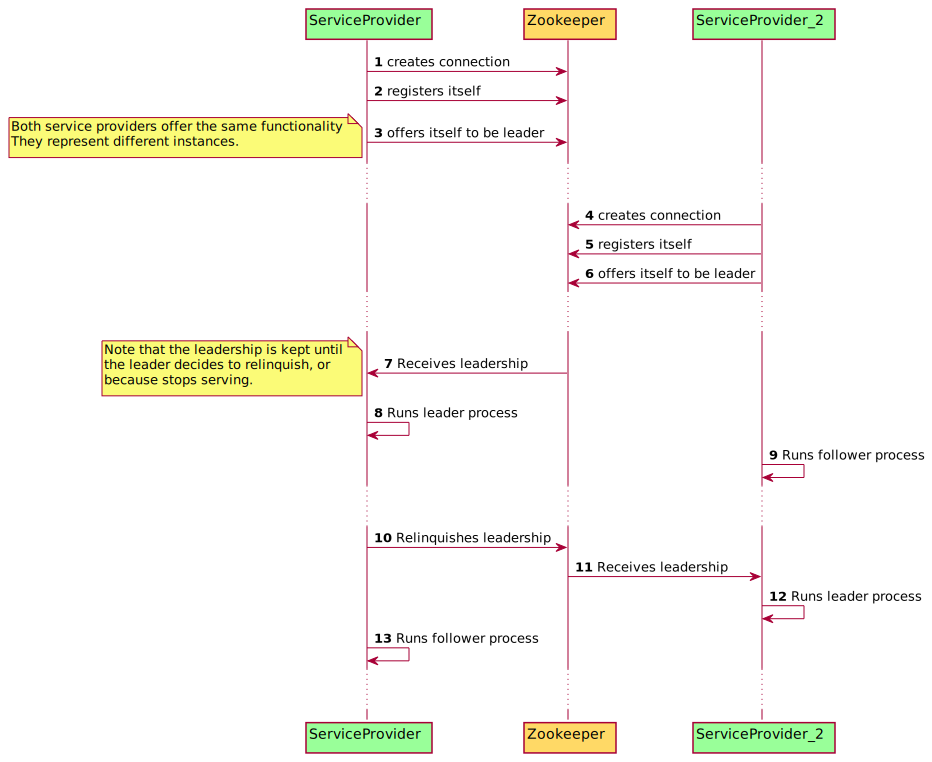

= Service Discovery & Leadership & Zookeeper

WARNING: -> This presentation is dangerous!

== Concepts

=== What is service discovery?

[.fade-in-then-semi-out%step]
Emerging trait in distributed systems

[.fade-in-then-semi-out%step]
How to observe which systems a service can talk with?

[.fade-in-then-semi-out%step]
Registration of services

[.fade-in-then-semi-out%step]
Usage of registered services

=== What is leadership in microservices?

[.fade-in-then-semi-out%step]
Process execution exclusivity in a family of instances

[.fade-in-then-semi-out%step]
Rotating job -time or condition-

=== What is Zookeeper?

[.fade-in-then-semi-out%step]
Enables distributed configuration control

[.fade-in-then-semi-out%step]
Enables distributed coordination of processes

[.fade-in-then-semi-out%step]
Enables distributed naming

[.fade-in-then-semi-out%step]
Data model and the hierarchical namespace (znodes)

=== Graphical representation for Zookeeper?

== How does all fit together

=== Service discovery

=== Leadership

== It is showtime!

[.fade-in-then-semi-out%step]
Let's see something a bit more practical

[.fade-in-then-semi-out%step]
https://github.com/ubirch/zookeeper-service-discovery/blob/master/README.md#project-structure[Click here to go to demonstration]

== We made it: Thanks
